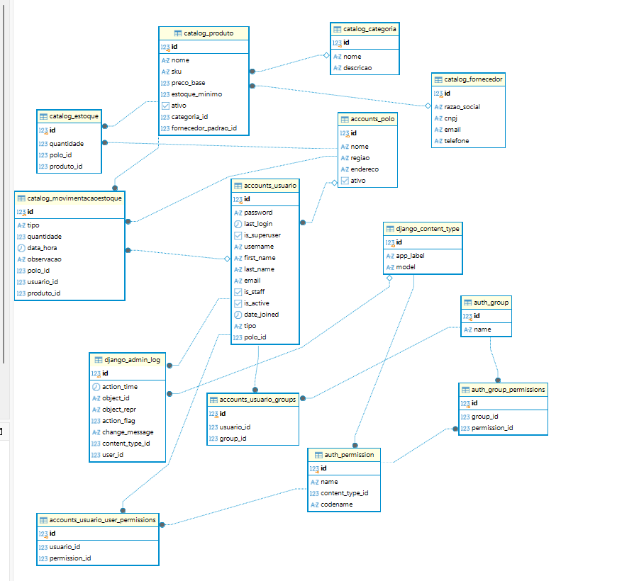

# inventory-control-api
API de Controle de Estoque e Movimentações

accounts (Identidade e Acessos):

    Usuario (Admin, Vendedor, Estoquista)

    Polo (Filial física à qual o usuário pode estar vinculado)

catalog (Produtos, Estoque e Qualidade):

    Produto

    Categoria

    Fornecedor

    Estoque (Saldo por polo)

    MovimentacaoEstoque (Entrada, saída, transferência, ajustes)

    LoteRIR (Relatório de Inspeção de Recebimento / Veredito de qualidade)

sales (Transações Comerciais e PDV):

    Cliente (Dados PF/PJ, validações e tratamento de nulos)

    Venda (Venda física via PDV ou online via Ship from Store)

    ItemVenda

    FechamentoCaixa (Consolidação diária do vendedor)

